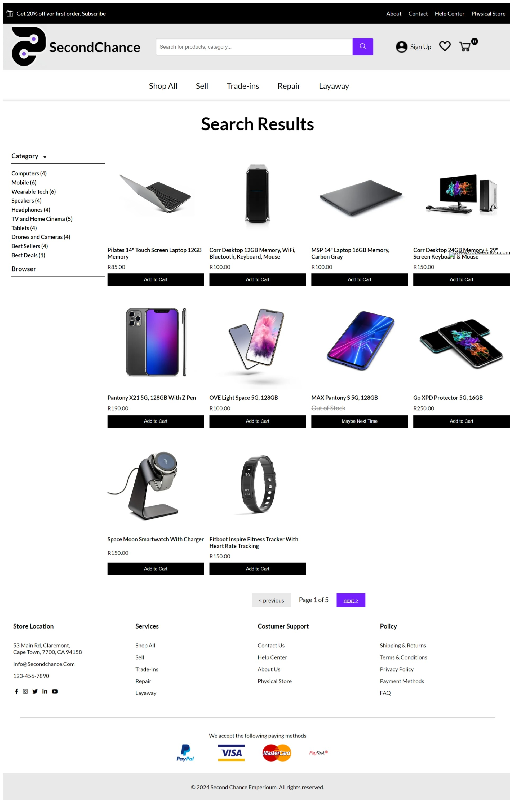
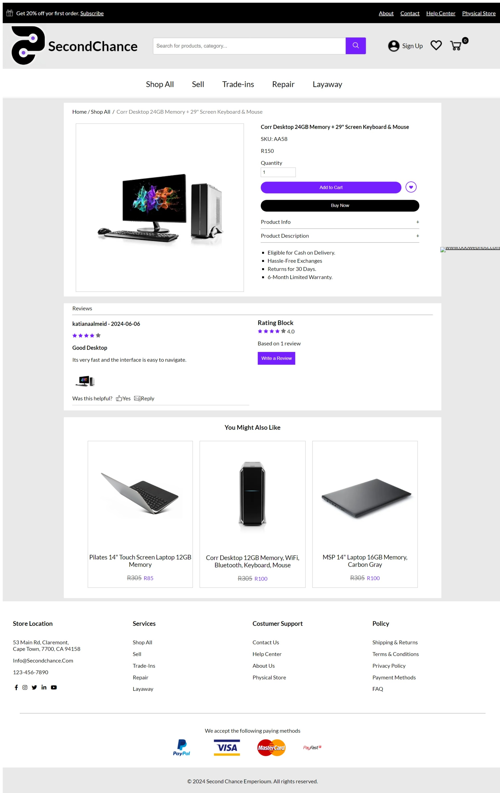
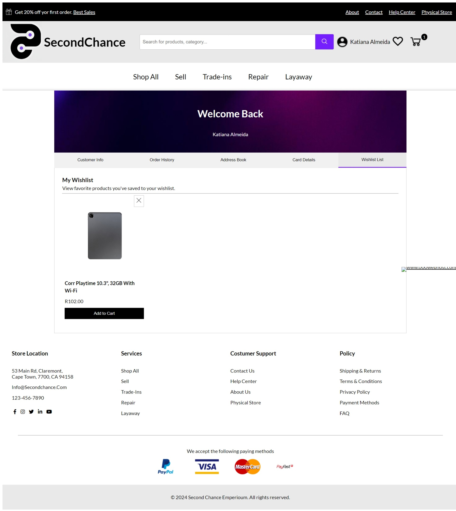
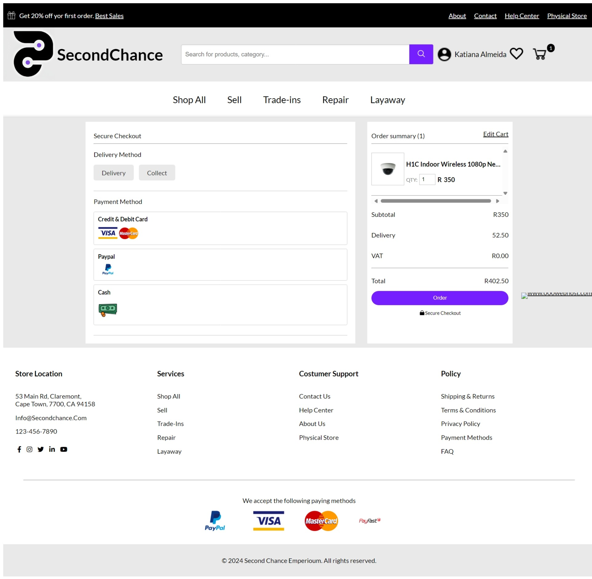

# SecondChance Imperium

Welcome to SecondChance Imperium, your premier online platform for buying and selling high-quality second-hand goods. Our user-friendly website offers a seamless shopping experience, complete with features such as product browsing, secure checkout, trade-ins, repairs, and layaway services.

## Table of Contents
- [Repository Description](#repository-description)
- [Features](#features)
- [Getting Started](#getting-started)
- [Usage](#usage)
- [Author](#author)
- [Screenshots](#screenshots)

## Repository Description
This repository contains the source code for SecondChance Imperium, an ecommerce platform dedicated to buying and selling high-quality second-hand goods. It features intuitive product browsing, secure checkout, trade-ins, repairs, and layaway services, aiming to replicate and enhance the in-store shopping experience online.

## Features
- **Intuitive Product Browsing:** Easily search and browse through a wide range of products, including electronics, appliances, musical instruments, and tools.
- **Secure Checkout:** Safe and secure online payment options for a hassle-free shopping experience.
- **Trade-Ins and Repairs:** Conveniently request trade-ins and repairs directly through our website.
- **Layaway Services:** Flexible layaway options to help you purchase your desired products.
- **Add to Wishlist:** Save your favorite products to your wishlist for easy access later.
- **Review Products:** Share your feedback and read reviews from other customers.
- **Admin Tools:** Comprehensive admin tools for managing products, orders, and customer interactions.

## Getting Started
To get started with SecondChance Imperium, follow these steps:
1. Visit our website: [SecondChance Imperium](https://secondchanceemperium.000webhostapp.com/home.php)
2. Create an account: Sign up to start browsing and purchasing products.
3. Explore our products: Use the search and category filters to find what you need.
4. Make a purchase: Add items to your cart and proceed to checkout for a secure transaction.

## Usage
### Browsing Products
- Use the search bar to find specific items.
- Filter products by category, price range, and condition.

### Making a Purchase
- Add desired items to your cart.
- Review your cart and proceed to checkout.
- Enter your payment information and complete the purchase.

### Add to Wishlist
- While browsing, click the "Add to Wishlist" button to save a product.
- View your wishlist from your account dashboard for easy access to your favorite items.

### Review Products
- After purchasing, leave a review for the product.
- Read reviews from other customers to make informed decisions.

### Trade-Ins and Repairs
- Visit the Trade-Ins or Repairs section from the main menu.
- Follow the instructions to submit a request.

### Layaway Services
- Select the layaway option during checkout.
- Follow the prompts to set up your layaway plan.

## Author

- Portfolio Website - [Katiana de Almeida](https://katiana-de-almeida.onrender.com/)
- Katiana Almeida - [Katianaalmeida48@gmail.com]
- Linkdlin - [KatianaDeAlmeida](https://www.linkedin.com/in/katiana-almeida-1731ba23a/)

## Screenshots
Here are some screenshots of the SecondChance Imperium platform:

- **Home Page**
  

- **Product Listing**
  

- **Product Details**
  

- **Wishlist**
  

- **Checkout**
  
